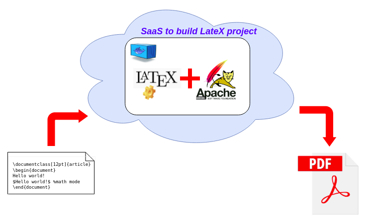

# Introduction
LateX language is among the most popular choice to generate documentations with high quality.
The problem is to build a document written in LateX language, one will need to compile it with a tool, such as pdflatex.
Installing this tool can sometimes be cumbersome and disk-space consumming (up to 4GB)
Imagine of a team composed of a lot of members, each of those choses to use LateX for documentation. They would need to install locally on their machine.
Hence, using the concept of Software as a Service (SaaS) for such LateX builder could save a lot of IT resources.
# Architecture
As stated in the Dockerfile, I used the base-image of ivanpondal/alpine-latex:1.1.0 that contains a version of pdflateX.
Tomcat 9.0.34 is installed additionally.
This project consists of implementing the Front end JSP to allow user to provide the LateX sourcecode to build their document in pdf format.

# How to build
You will need Maven to build Java/JSP project.
```
mvn clean install
```
The obtained .war needs to be injected into docker image of Tomcat + pdflateX
```
docker build -t cat-in-latex .
```

# How to run with Docker command
```
docker run -p 8080:8080 cat-in-latex
```
Service can be accessed via : http://localhost:8080/cat-in-latex/
